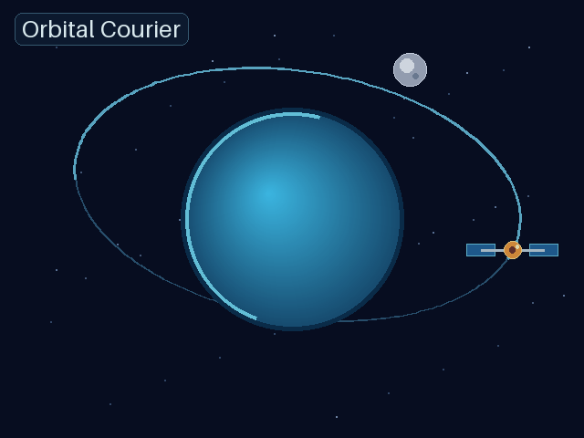
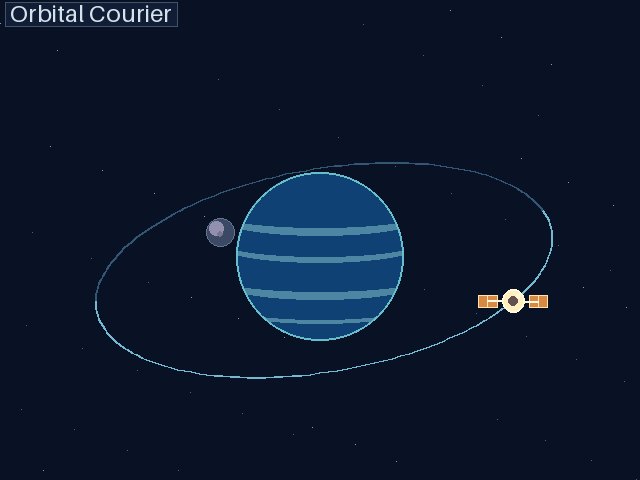

# 同一 task 十輪：程式設計與 3D 動畫（2026-09-16）

## 情境與方法

沿用 [UI/UX 十輪測試](same-task-dialogue-10turn-20260916.md) 的持續 thread 量測方式，新增兩個獨立領域。每個領域的 baseline 與 UAP 組都從同一份空白任務專案開始、使用相同的十個自然語言追問、`gpt-5.6-sol` / low reasoning；每組始終留在自己的同一個 Codex task。UAP 組使用專案初始化與 execution packet，**不是**完整 Orchestrator。原始用途是比較「同 task 多輪」而非跨 task 記憶。

- 程式設計：一個個人記帳工具，十輪依序加入新增／列出、輸入驗證、分類篩選、月總額、CSV 匯出、原子匯入、修改、刪除、JSON 持久化、分類月報。品質檢查每輪重新執行已提出功能的實際 API 呼叫。
- 3D 動畫：同一個 Orbital Courier 行星／衛星場景，十輪依序改善 3D 運動、傾斜橢圓軌道、月亮、自轉、光色深度、鏡頭、星層視差、無縫循環、標題、雙尺寸 GIF 匯出。這是程式生成並投影的 3D 動畫，不是假稱為 Blender `.blend` 專案。品質檢查讀取 XYZ、打開 GIF 並比較影格。

完整逐字 prompt 與檢查程式在 `scripts/same_task_domain_quality.py`。兩組的生成成品、每輪原始計數及快照保留於本機 `.benchmark-same-task-{programming,animation}10-sol-20260916-r1/`；GitHub 上的去識別化逐輪數據見 `benchmark-results/same-task-{programming,animation}10-sol-20260916.json`。

## 實測結果

| 領域 | 對照組總 Token | UAP 總 Token | UAP 差異 | 對照組未快取 | UAP 未快取 | UAP 未快取差異 | 最終外部門檻 |
|---|---:|---:|---:|---:|---:|---:|---|
| 程式設計 | 1,518,939 | 1,135,490 | −25.24% | 53,851 | 55,938 | +3.88% | 兩組 10/10 通過 |
| 3D 動畫 | 2,346,769 | 1,837,206 | −21.71% | 98,321 | 64,918 | −33.97% | 兩組 10/10 通過（更正後） |

程式設計用時：baseline 407.79 秒、UAP 330.10 秒（−19.05%）。3D 動畫用時：baseline 584.40 秒、UAP 481.42 秒（−17.62%）。這些是單組成對樣本的描述性差異，不是統計顯著性或訂閱額度節省率。

為避免只測「剛好對應十個例子」，完成後另做固定種子的壓力測試：兩份記帳工具各執行 180 次新增／更新／刪除與月總額核對、CSV／JSON 往返；兩份動畫各檢查 32 個場景時間點、12 張影格，且輸出 320×240、640×480 的 16 影格循環 GIF。四份成品都通過；機器可讀結果在 `benchmark-results/same-task-stress-20260916.json`。這仍無法證明所有邊界條件或主觀美術品質。

### 3D 成品（可直接觀看）

對照組：

UAP：

兩份最終記帳工具程式碼在 `benchmark-results/same-task-programming-20260916/`。動畫影格的視覺風格明顯不同；本測試僅能說兩者通過結構與輸出門檻，**不能說美術品質等價**。人工看單張影格時，baseline 的行星漸層較細緻，UAP 的表面條紋較簡化；這是非盲測觀察，不作為分數。

## 品質檢查器更正

原始 3D 執行時，檢查器只接受 `(x,y,z)`，誤拒絕 UAP 的 `{"position": (x,y,z)}` 節點。這兩種都是有效 3D 座標表示。原始 `report.json` 未改動；修正後對**兩組所有 20 份原始碼快照**重新評分，記錄在 `rescore.json`，結果兩組各 10/10 通過。GitHub 上的動畫逐輪公開數據採用更正後結果，並明示原因。這不是讓 UAP 免費修改成品，也沒有追加模型輪次。

## 解讀限制

- 三個領域（含先前 UI/UX）目前各只有一組成對十輪，且順序皆是 baseline 先、UAP 後；需要反向順序、多個隨機種子與更多任務，才能提高因果信心。
- UAP 同時改變了初始化和 prompt 封包，無法從此資料分離哪個機制帶來差異。
- 程式功能與 3D 動畫輸出的自動門檻不等於可維護性、可用性、無障礙或藝術品質的盲評。
- Provider 回報的總 Token、未快取 Token、訂閱額度是不同指標，不能互相直接換算。
- `--max-tokens-per-arm` 是每輪啟動前檢查，非進行中的硬上限。3D baseline 最終超過設定的 200 萬啟動門檻，原始數據完整保留。
